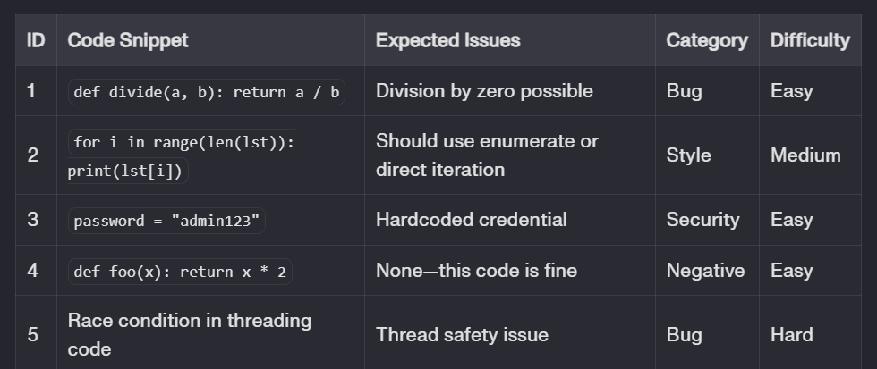
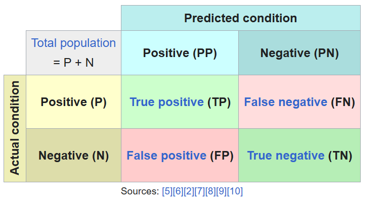

## Prompt Evaluation:

### Designing your evaluation dataset
An evaluation dataset is just a collection of test cases for your prompt. Think of it as a final exam: you want questions that cover the full range of what your prompt might encounter, not just the easy stuff.
Each test case needs an input (the code to review), the expected output (what issues should be found), some tags for categorization (bug, style issue, security problem), and ideally a difficulty rating.

Example:

 most generally, whatever particular metric associated to the confusion matrix is most relevant for the question. 

 

 
 Also, precision and recall metrics:
 https://en.wikipedia.org/wiki/Precision_and_recall

### Comparing prompt variants

Once you have a dataset and metrics, you can actually compare different versions of your prompt and know which one works better.

__Caveat:__ with a small test set (say, 10 cases), these differences might just be noise. For confident conclusions, use at least 50 test cases, and consider statistical significance if the numbers are close.

Article about statistical significance:https://en.wikipedia.org/wiki/Student's_t-test

### Iteration:
Evaluation isn't something you do once. It's a loop: test, identify problems, fix them, test again.

When results disappoint, look for patterns in the failures. Does the prompt have blind spots—types of bugs it never catches? Is it over-flagging, marking correct code as problematic? Are outputs inconsistent in format? Is it hallucinating issues that don't exist?

Once you spot a pattern, make a targeted fix. This is important: change one thing at a time. If you rewrite the whole prompt because "it wasn't great," you won't know what actually helped.

Eventually you need to stop iterating. Good stopping points: you've hit your target metrics, you've plateaued (multiple changes with no improvement), you're hitting trade-offs (improving one metric hurts another), or you're out of time. Perfect is the enemy of shipped.

Set your targets upfront. "I need >85% accuracy and <15% false positives." Once you're there, move on.

__Comparision between providers:__we need to keep comparing diffrerent models by OpenAI, Google, etc. to see if we cen have a better performance. conditions:

1) The prompt performs really badly, no matter what we try. Would a more expensive model solve these problems? What kind of metrics would justify the cost increase?
2) The prompt works really well; how much money can I save by using weaker models, while still keeping the performance?
3) The API provider for our favorite LLM we have been using for years is down, but we need to use this application as soon as possible. How can we be confident a different LLM will also perform well?

###  Model Benchmark
There are websites that show what model work better for what type of task. links are in the ai_news_platform.md document.

### Professional Evaluation Frameworks:

https://github.com/confident-ai/deepeval
DeepEval is an open-source, production-grade LLM evaluation framework offering 14+ pre-built metrics (answer relevance, coherence, hallucination, bias) with seamless integration into CI/CD pipelines via pytest-like syntax. Its standout feature is G-Eval, an LLM-as-a-judge metric using chain-of-thought reasoning to evaluate any custom criteria with human-like accuracy by auto-generating evaluation steps and normalizing scores via token probability weighting.

https://github.com/vibrantlabsai/ragas
RAGas (Retrieval-Augmented Generation Assessment) is a reference-free evaluation framework purpose-built for RAG pipelines, measuring four core dimensions: context recall (did the model use important context?), context precision (was retrieved information relevant?), answer relevancy (does the answer address the query?), and faithfulness (is the answer grounded in retrieved context). It scales across open and closed LLMs without requiring ground truth human annotations, enabling rapid evaluation cycles and fine-grained diagnostics to optimize retrieval methods (BM25 vs. hybrid vs. dense) and pinpoint failure modes.

https://github.com/Giskard-AI/giskard-oss this tool focuses on security of applications.

https://github.com/promptfoo/promptfooPromptfoo is a popular, JS/TS-first evaluation framework built for TypeScript AI Engineers who want repeatable, CI-friendly testing of prompts, agents, and RAG flows. It provides a declarative config + CLI workflow to run regression suites, compare models/providers side-by-side, score outputs with both deterministic checks and LLM-as-a-judge graders, and generate shareable reports. Promptfoo also stands out for built-in red teaming and vulnerability scanning (e.g., jailbreak and safety tests), making it practical for shipping LLM features with measurable quality and security guardrails.

