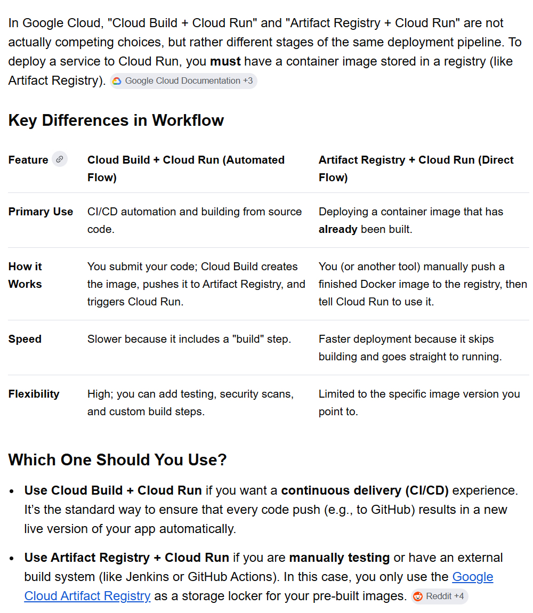

### Connect AI agenets to the web
https://www.tavily.com/

### Cloud Build:
For deployment on Cloud Run there is another way (using cloud build instead of artifact registry):

### For more advanced and production level deployment
https://registry.terraform.io/

### for more simple deployments
https://fly.io/

### For landing pages and static pages deployment
https://www.netlify.com/

### MCP that takes control of your chrome browser and does stuff
https://github.com/remorses/playwriter

### Save 80% of token usage converting HTML into md files for agents
https://markdown.new/

### Amazon service to Access a global, on-demand, 24x7 workforce
https://www.mturk.com/

### Run cognitive experiments online
https://www.cognition.run/

### a coding agent same level as KIMI 2.5 but half the price (chinese)
https://llmbase.ai/compare/kimi-k2-5,minimax-m2-7/

### Google AI Studio
Google AI Studio is a browser-based integrated development environment (IDE) designed to help developers quickly prototype, test, and deploy generative AI applications using Gemini models. 

### run and deply ai models via this api wrapper for better speed
https://replicate.com/

### Neon
Neon is a fully managed, serverless, open-source Postgres designed to help developers build scalable, dependable applications faster than ever

https://neon.com

### Rent gpu
https://vast.ai/

https://runpod.io

### Open source AI toolkit: Ostris AI Toolkit
https://github.com/ostris/ai-toolkit?tab=readme-ov-file

### Open platform for AI workflows
https://www.floyo.ai/
